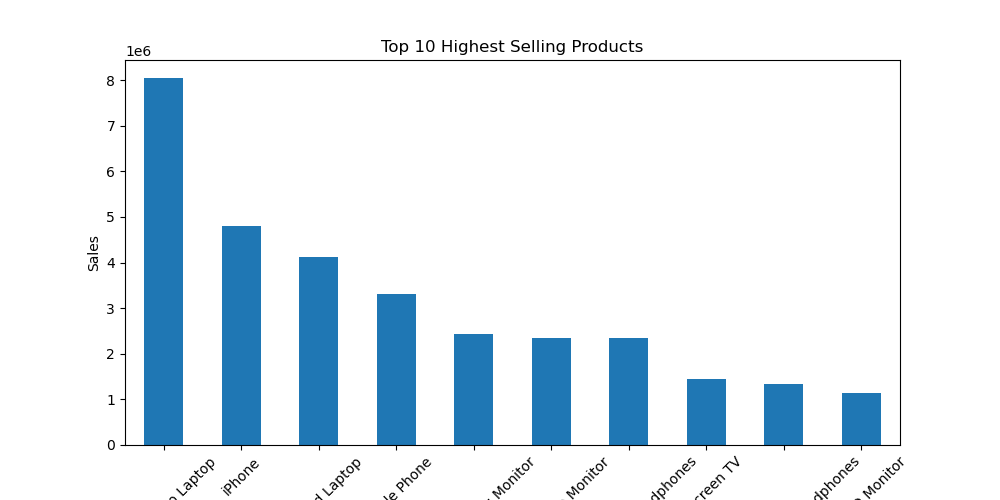
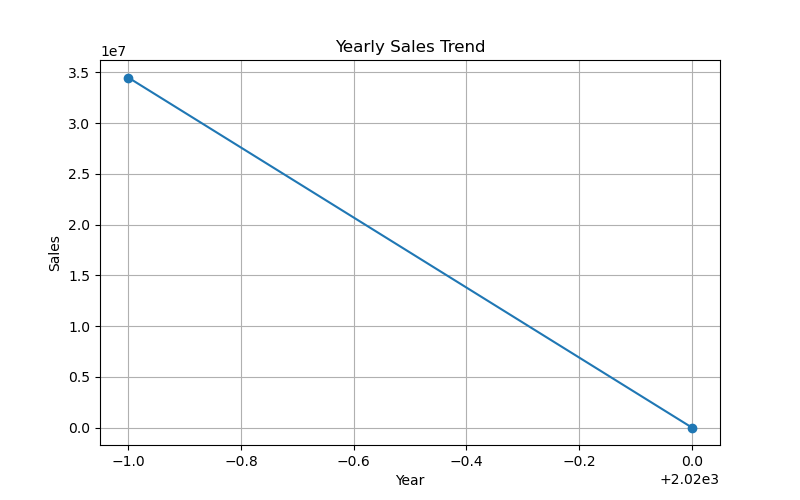
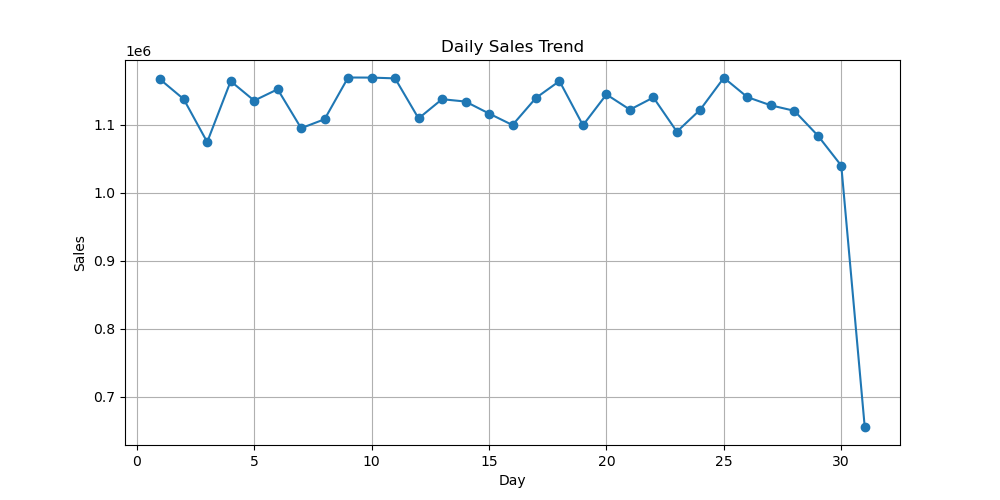
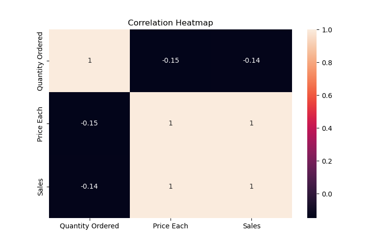

# Sales_Data_Analysis
Exploratory Data Analysis (EDA) project analyzing sales performance, trends, and customer purchasing patterns using Python.

## Objective
The objective of this project is to analyze sales data and identify:
- Highest Selling Products
- Highest Selling Cities
- Sales Trends
- Relationships between variables

## Tools Used
- Python
- Pandas
- Matplotlib
- Seaborn
- Jupyter Notebook

## Analysis Performed
1. Data Overview
2. Missing Value Analysis
3. Highest Selling Product Analysis
4. Highest Selling City Analysis
5. Yearly Sales Trend
6. Daily Sales Trend
7. Correlation Analysis
8. Heatmap Visualization
9. Relationship Analysis using Scatter Plot
  
## Visualizations
- Bar Chart for Top Selling Products
- 
- Bar Chart for Top Selling Cities
-  
- Line Chart for Yearly Trend
-  
- Line Chart for Daily Trend
- 
- Correlation Heatmap
- 
- Scatter Plot
- 

## Key Findings
- Identified the highest revenue-generating product.
- Identified the city with the highest sales.
- Analyzed yearly and daily sales trends.
- Studied relationships between Price, Quantity Ordered, and Sales.

## Future Scope
- Sales Forecasting
- Interactive Dashboards
- Advanced Machine Learning Models
